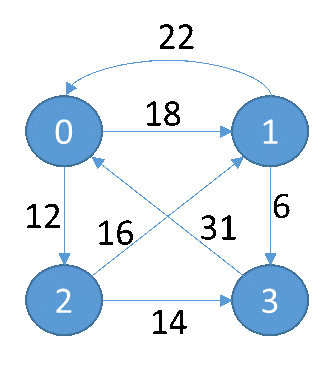
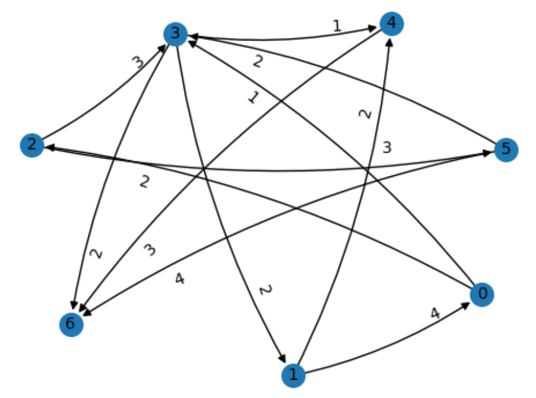
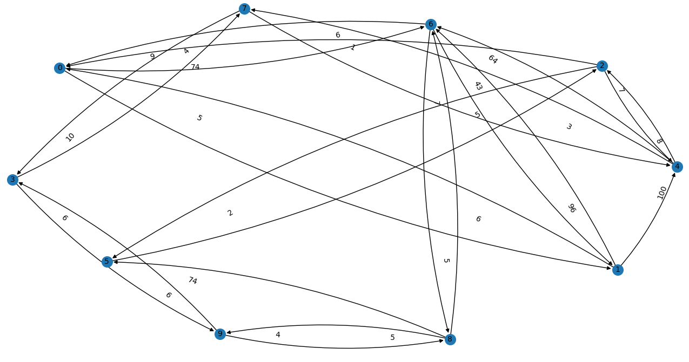
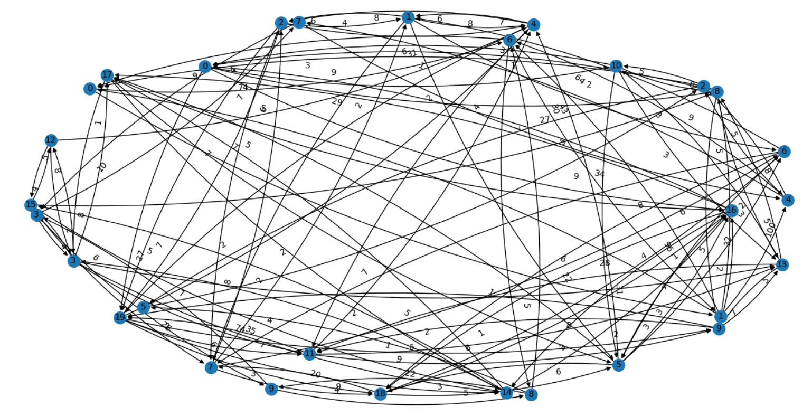
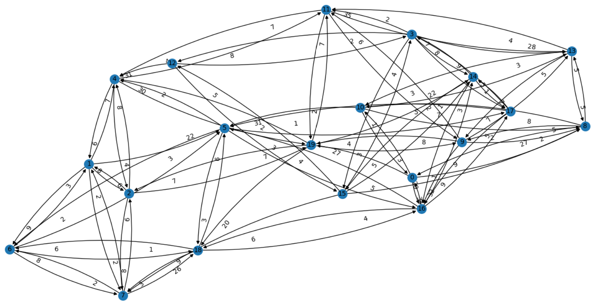
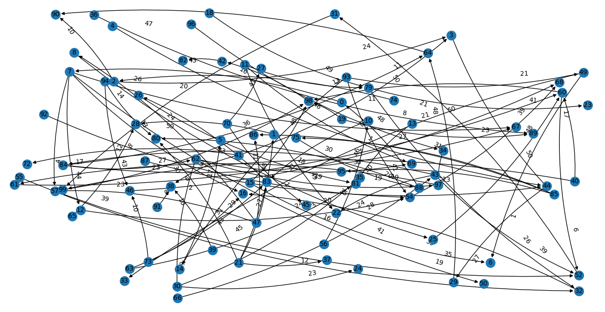

# Assignment02: Shortest Paths in Graphs

Write a **Java program** that implements **Dijkstra's algorithm** to find shortest paths to all vertices in a directed **weighted** graph from a given starting vertex. 

As mentioned in the lectures, choosing an implementation for the data structure representing a graph is highly dependent on the sparsity of the graph. For dense graphs, an adjacency matrix representation is preferable, but for sparse graphs, an adjacency list representation may be more efficient. You are asked to implement either the adjacency list or adjacency matrix representation for graphs in your program.  If you choose to extend you implementation from Lab03 then it will need account for **weighted edges**.

Your program should (a) read in data defining a graph from a **GraphML** file, (b) **build** an **adjacency list** OR **adjacency matrix** representation of the **weighted** graph and (c) use the graph representation to **find shortest paths** from a specified vertex in the graph to all other vertices, using **Dijkstra’s algorithm***, as specified in the lectures and tutorials. 

In addition, you should (d) provide **documentation** for your program describing how to run it, and explaining how the code works. You should also justify your choice of data structures*, and details of your code implementation, in terms of space and time efficiency.

 *(e) Use both a standard **List (or array)** and Java’s **java.util.PriorityQueue** for the storing the **list of tentative distances** from the given starting vertex to other vertices and compare the performance (e.g. runtime, memory, etc).  
 
 > You should submit a document (PDF format) outlining your comparisons.

(f) Implement your own Priority Queue class using a **Heap** as described in lectures and tutorials. Compare your implementation with the List/array and built-in PriorityQueue.  Implementing your own priority queue should allow you to make optimizations specific to the Dijkstra’s Algorithm (e.g. not being generic, insert new value instead of full update) that the Java PriorityQueue must maintain to be widely usable.

## Marking Guide

The expectation is that all students attempt parts (a)-(f).  All students should be able to complete parts (a)-(d) and most should be able to complete part (e).  Part (f) is potentially more challenging. The table below gives an indication as to the distribution of marks to the parts of the assignment described above.

| Part | Weight (100%) | Weight (30%)|
|------|--------------:|------------:|
|  a   | 5             |     1.5     |
|  b   | 15            |    4.5      |
|  c   | 25            |    7.5      |
|  d   | 20            |    6.0      |
|  e   | 20            |    6.0      |
|  f   | 15            |    4.5      |
| **Total**| **100**   |  **30.0**   | 

## Getting Started

To get started you need the checkout the skeleton project from the assignment code repository.  The subversion code repository is based on your FAN and the assignment.  For example, if your FAN is **blog0001**, then the repository is:

https://topicsvn.flinders.edu.au/svn-repos/COMP3712/blog0001/ass02/GraphShortestPath/

The repository contains sample code for parsing graphml data files, a [`Graph`]((src/cp3/ass02/graphshortestpath/Graph.java)) interface, which you are welcome to modify as you please, a driver class called [`GraphShortestPathDriver`](src/cp3/ass02/graphshortestpath/GraphShortestPathDriver.java) that can parse the standard input, and [`GraphBuilder`](src/cp3/ass02/graphshortestpath/GraphBuilder.java) class that can parse the data format described below.  These classes should allow you to focus on the implementation of the Dijkstra's shortest path algorithm.

## Data Format
There are a number of example graphml files in the repository provided as example input and output files. There files are located in the `data/graphs/` directory.  For example:
- [`data/graphs/graphSpecExample.graphml`](data/graphs/graphSpecExample.graphml)
- [`data/graphs/graphTutorialExample.graphml`](data/graphs/graphTutorialExample.graphml)
- [`data/graphs/graph10.graphml`](data/graphs/graph10.graphml)


Feel free to test your program with your own files as well. The data format uses the **GraphML**, which is described in detail here: [http://graphml.graphdrawing.org/primer/graphml-primer.html](http://graphml.graphdrawing.org/primer/graphml-primer.html)

You could capture the output of your program and then use a diff program to compare to the expected output.  This might be quicker than FLO Self-Review Quizzes (see below).  IntelliJ IDEA has a nifty file comparison tool: [https://www.jetbrains.com/help/idea/comparing-files-and-folders.html](https://www.jetbrains.com/help/idea/comparing-files-and-folders.html)


And there plenty of online diff tools can be found here, for example: [http://www.mergely.com/editor](http://www.mergely.com/editor)

The **JDOM** library is an easy to use XML parsing library for Java.  This library is included in the repository (see the lib/ directory).  The binary download is available here: [http://www.jdom.org/downloads/index.html](http://www.jdom.org/downloads/index.html)

The XML file contains a list of vertices/nodes (the `<node>` element) and then a list of edges (the `<edge>` element).  The weight for an edge is store as a child of the edge as `<data>` element with a `key` attribute of `"d1"` and the value of the data element is the weight.

> NOTE: All graphs start with a vertex with the "id" of "0" and increment by 1.  This could be handy if you were using arrays or lists to represent key data structures in the graph shortest path algorithm...

For example, the contents of `graphSpecExample.graphml` is:

```xml
<?xml version="1.0" encoding="UTF-8"?>
<graphml xmlns="http://graphml.graphdrawing.org/xmlns">
  <key id="d1" for="edge" attr.name="weight" attr.type="int"/>
  <graph id="G" edgedefault="directed">
    <node id="0"/>
    <node id="1"/>
    <node id="2"/>
    <node id="3"/>
    <edge id="0" source="0" target="1">
      <data key="d1">18</data>
    </edge>
    <edge id="1" source="0" target="2">
      <data key="d1">12</data>
    </edge>
    <edge id="2" source="1" target="0">
      <data key="d1">22</data>
    </edge>
    <edge id="3" source="1" target="3">
      <data key="d1">6</data>
    </edge>
    <edge id="4" source="2" target="1">
      <data key="d1">16</data>
    </edge>
    <edge id="5" source="2" target="3">
      <data key="d1">14</data>
    </edge>
    <edge id="6" source="3" target="0">
      <data key="d1">31</data>
    </edge>
  </graph>
</graphml>
```
then this means that there are 4 vertices, numbered 0 to 3. Vertex 1 has an edge to vertex 2, with weight 18, and an edge to vertex 3 with weight 12. Vertex 2 has an edge back to vertex 1, but its weight is 22 (because this is a directed graph, if there is an edge from A to B, it does not mean that there is an edge from B to A, or if there is, the weights do not need to be the same). 

A visual representation of this graph is shown below:



## Expected Output
If coded correctly, a call to find shortest paths from vertex 0 from the Graph above should produce the following output:

```
shortest path to 0: 0: cost = 0
shortest path to 1: 0 1: cost = 18
shortest path to 2: 0 2: cost = 12
shortest path to 3: 0 1 3: cost = 24
```
This lists each Vertex (in ascending lexicographical order) and for each Vertex, the path from the given vertex to that vertex and the associated cost with that traversal.

The graph in `graph10.graphml` has size of 10 vertices. If coded correctly, a call to find shortest paths from vertex 0 should produce the following output: 

```
shortest path to 0: 0: cost = 0
shortest path to 1: 0 1: cost = 6
shortest path to 2: 0 6 8 9 3 7 4 2: cost = 35
shortest path to 3: 0 6 8 9 3: cost = 21
shortest path to 4: 0 6 8 9 3 7 4: cost = 28
shortest path to 5: 0 6 8 9 3 7 4 2 5: cost = 37
shortest path to 6: 0 6: cost = 6
shortest path to 7: 0 6 8 9 3 7: cost = 25
shortest path to 8: 0 6 8: cost = 11
shortest path to 9: 0 6 8 9: cost = 15
```

## Self-Review Quiz

FLO will contain self-review quizzes to help test your assignment.  The program must accept one line of input on the standard input that contains the name of the file to load in graphml format, a space, and then the index of the starting vertex (starting from 0).  This is what the classes `GraphShortestPathDriver` and `GraphBuilder` are design to do. The output should be as above, but it should also include vertices that are unreachable from the starting vertex with the output of `NO PATH`, For example (user input indicated with `<-- user input`):

```
data/graphs/random_v10_e10_w50.graphml 0         <-- user input
shortest path to 0: 0: cost = 0
shortest path to 1: NO PATH
shortest path to 2: 0 2: cost = 49
shortest path to 3: 0 5 7 3: cost = 75
shortest path to 4: 0 2 4: cost = 93
shortest path to 5: 0 5: cost = 25
shortest path to 6: 0 5 6: cost = 29
shortest path to 7: 0 5 7: cost = 50
shortest path to 8: NO PATH
shortest path to 9: NO PATH
```

**NOTE:** The self-review quizzes are a guide only and for your own personal review of your progress.  Marks are awarded based on the code submission and other tests run by the assessors.  Partial (or even full) marks maybe award even if your code does not conform to the expected output or otherwise fails the self-review quizzes. 

## Submission of the Assignment

Submission will be via both FLO and the repository.  You should submit the revision number of your repository that you consider your final commit for the assignment to FLO and any other required documents as PDF.  If there are any special requirements for running the program these should be detailed in the document about running your program.  Additional documents should be in PDF format.  If you have utilised additional data files for your assignment and they are too large to upload to FLO or put into the repository then provide a link in your documentation.

## Additional Graph Visualisations

Below are some graph visualisations for some of the smaller example graphs in the data directory.  The visualisations were created using Python and the `pygraphml` and `networkx` modules. The graphs are automatically laid out, so YMMV in the usefulness!

If you are really keen you can check this out and a shortest path solver that creates a pptx of the steps out on Trent's Google Colab: [https://colab.research.google.com/drive/13RGOJ1W3ACH-9zPKjH87Esv3YmD_Dc-B?usp=sharing](https://colab.research.google.com/drive/13RGOJ1W3ACH-9zPKjH87Esv3YmD_Dc-B?usp=sharing). You will find the required `graph_template.pptx` on FLO. 

Note, the code on the link is hastily hacked together and the graph data structure is an *edge list* which is an *inefficient* data structure for the shortest path algorithm.  You should be using an adjacency list or adjacency matrix. 

### graphTutorialExample.graphml


### graph10.graphml


### graph20.graphml


### graph20.graphml (same graph different layout)


### random_v10_e10_w50.graphml
